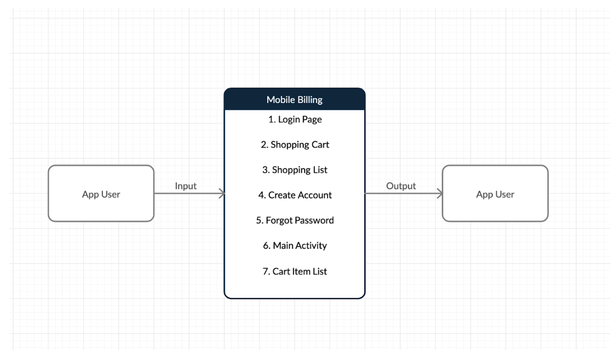
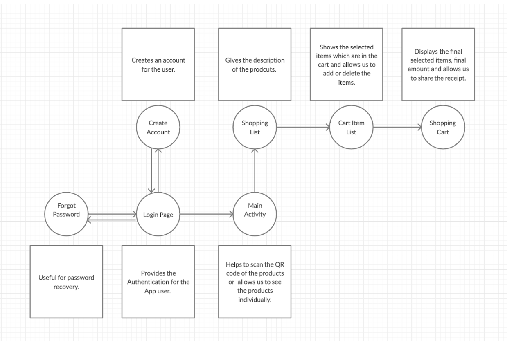

# Mobile-Billing App
 
In Today’s world, People’s lives are mainly dependent on the mobile phones.In recent times, a lot of applications have been developed/created. There are many advantages and disadvantages by using these applications. We hope that the  application that we have created is beneficial and helpful for the people. The main purpose of this application is to reduce the wait time near the billing counter in the grocery stores. We have developed a “Mobile Billing” application that will help you to automatically scan the products that you want to purchase by using QR code scanner that is inbuilt in this application and make the payments for the purchase. This application can be used by customers for self checkout while shopping. The customer downloads the app from the Android Marketplace (Play Store) and scans the items for self checkout without waiting in line to bill items in their cart. It's like having a personal checkout assistant.

 

### Functional Requirement

- Scan a barcode/QR code on the product
- Identify the product and price
- Add/Modify Payment Method
- Calculate the sub-totals, taxes and total price
- Accept payment and complete purchase

### User Requirements
- Mobile Device
- Android OS
- Application installed and compatible with user's android version

### Database Design

For this Application we have used the Google Firebase Realtime Database. The Firebase Realtime Database is a cloud-hosted NoSQL database that lets you store and sync data between your users in realtime. Realtime syncing makes it easy for your users to access their data from any device, be it web or mobile. Realtime Database also helps your users collaborate with one another. 
 
In this NoSQL database, we have created some columns such as description, id, imageURL, name and price where each individual column has its own individual action performed in the database.
 
- Description:  It gives a brief introduction about the item.
- id: It is a primary key.
- imageURL : This acts as an image source for the products.

### App Features

#### Workflow

- Secure access with accont/Google authentication
- Track billing/invoice information, Order Summary
- QR Code Scanning
- Payment Method Storage
- Manage customer information

#### Payables

- Access your payment history
- Checkout quickly and easily
- Multiple payment options

#### Receivables

- Manage products and customer
- Create invoice
- Keep track of payments received

#### DFD Diagrams
- DFD level-0

- DFD level-1

